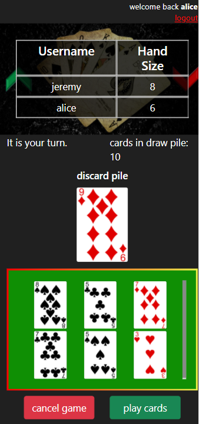

# Updown-app
SWE1 Project 3: full stack game app

## Website
https://updown-app.herokuapp.com/login

## Technologies used
- PostgreSQL, Sequelize, Express, Axios, Webpack, Bootstrap, HTML, CSS, JavaScript  

## About
Updown is a full stack multiplayer game which uses poker cards, with an intention to kill boredom by providing a simple form of entertainment and friendly competition.  

## How to Play
### Setup
1. From a poker deck, set aside 10 cards for the draw pile and 1 card for the discard pile. 
2. The leftover cards will be divided evenly among each player.

### Gameplay
1. Players will take turns attempting to play all the cards in their hands by sending valid cards to the discard pile. 
2. The winner is the first person who has no cards left, or when no one can play any valid cards while the draw pile is empty, the player(s) with the least cards wins. 
3. Valid cards played are:
  - cards that fall within a range of +-1 of the card in the discard pile
  - of the same value.
4. When a player plays a card, the 1st card that the player played will be the new discard pile card.

##### Gameplay page

